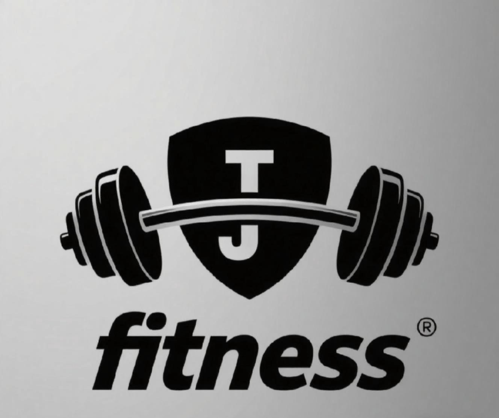

<!DOCTYPE html>
<html>
<head>
  <title>Juntela's Fitness GYM</title>
    
  
</head>
<body>

  <nav>
    

      
    

    <ul>
      <li><a href="about.html">About</a></li>
      <li><a href="products.html">Products</a></li>
      <li><a href="contact.html">Contact</a></li>
      <li><a href="samplewebpage.html">Home</a></li> 
    </ul>
  </nav>

</body>>

<section style="text-align: center; padding: 80px 20px; font-family: Arial, sans-serif; background-color:#1c1c1c;">
  <section class="about-section">
    <h1 style="font-size: 2em; color: white; margin-bottom: 20px;">Welcome to Juntela Fitness GYM</h1>
    

    At Juntela Fitness, we believe strength is more than lifting weights it is about building discipline, energy, and confidence. 
     Whether you are just starting your fitness journey or pushing toward your next goal, 
    our programs and products are designed to help you reach your peak performance. 
 </section>

  <footer>
    
&copy; 2025 Juntela's Fitness GYM | All Rights Reserved

  </footer>
